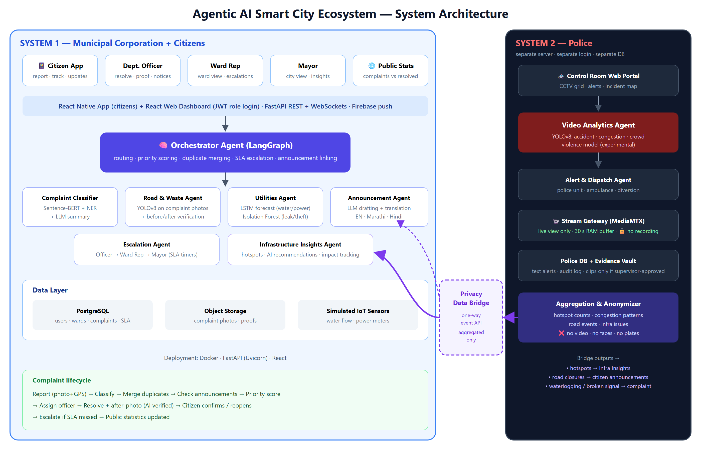
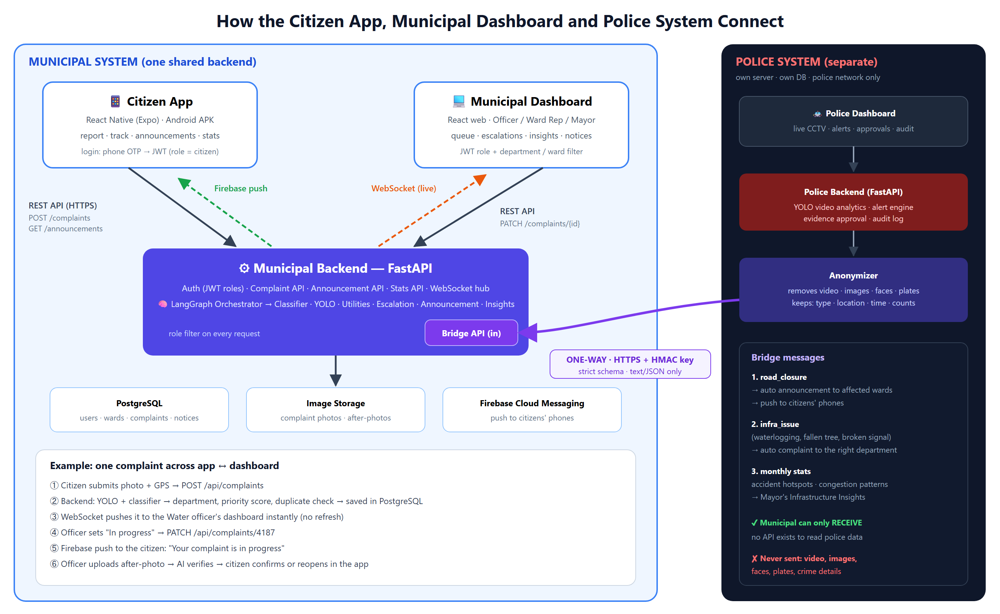
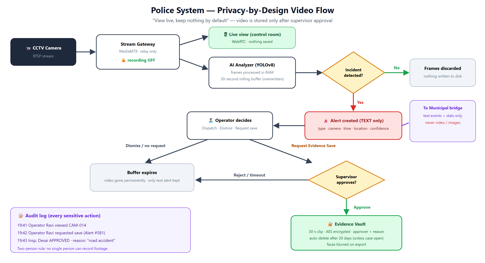

# Architecture.md — System Architecture

**Principle:** *One repository for development, independently deployable systems at runtime.*



---

## 1. Systems overview

```
┌──────────────────────────── SYSTEM 1: MUNICIPAL ────────────────────────────┐
│                                                                              │
│   📱 citizen-app/             💻 municipal/dashboard/                         │
│   React Native (Expo)          React + Vite (officer / ward rep / mayor)      │
│        │  REST + Firebase push       │  REST + WebSocket                      │
│        └──────────────┬──────────────┘                                        │
│                       ▼                                                       │
│   ⚙ municipal/backend/  FastAPI :8000                                         │
│      ├─ API routes (auth, citizen, staff, announcements, stats, insights)     │
│      ├─ AI agents (LangGraph orchestrator + classifier, YOLO, escalation …)   │
│      ├─ PostgreSQL (municipal DB)  +  media storage (photos)                  │
│      └─ /bridge/* (receive only)  ◄──────────────────────────┐                │
└──────────────────────────────────────────────────────────────┼────────────────┘
                                                               │ one-way HTTPS
                                                               │ HMAC-signed JSON
┌──────────────────────────── SYSTEM 2: POLICE ────────────────┼────────────────┐
│   🚓 police/dashboard/  React + Vite (control room)           │                │
│        │  REST + WebSocket + WebRTC video                     │                │
│        ▼                                                      │                │
│   ⚙ police/backend/  FastAPI :9000                            │                │
│      ├─ alerts, evidence approval, audit log                  │                │
│      ├─ video analytics (YOLOv8, RAM buffer, no recording)    │                │
│      ├─ police DB (separate)                                  │                │
│      └─ anonymizer → bridge client ───────────────────────────┘                │
│   📹 MediaMTX (RTSP → WebRTC relay, recording OFF)                              │
└──────────────────────────────────────────────────────────────────────────────┘
```



## 2. Folder structure

```
MyCityAI/
├── README.md
├── CLAUDE.md                     ← entry point for AI coding assistants
├── .gitignore
├── .github/
│   ├── CODEOWNERS                ← who must approve changes to each folder
│   └── pull_request_template.md
│
├── docs/                         ← planning docs (read before coding)
│   ├── PRD.md  Architecture.md  API.md  Rules.md  Phases.md  Design.md  Memory.md
│   └── assets/                   ← diagrams, mockups, project PDF
│
├── shared/                       ← the ONLY thing shared between systems (data, not code)
│   ├── constants.json            ← enums: roles, categories, statuses, departments …
│   └── bridge-schema/            ← JSON Schema for police → municipal messages
│
├── municipal/
│   ├── backend/                  ← FastAPI (owner: Paras)
│   │   ├── app/
│   │   │   ├── main.py
│   │   │   ├── core/             config, security (JWT), db session
│   │   │   ├── models/           SQLAlchemy models
│   │   │   ├── schemas/          Pydantic request/response models (match API.md)
│   │   │   ├── routes/
│   │   │   │   ├── auth.py
│   │   │   │   ├── citizen.py            ← citizen endpoints (friend may edit)
│   │   │   │   ├── complaints_staff.py
│   │   │   │   ├── ward.py
│   │   │   │   ├── mayor.py
│   │   │   │   ├── announcements.py
│   │   │   │   ├── stats.py
│   │   │   │   ├── insights.py
│   │   │   │   ├── bridge.py
│   │   │   │   └── ws.py
│   │   │   ├── services/         business logic (status transitions, SLA, push)
│   │   │   └── agents/           orchestrator, classifier, vision, escalation, announcement, utilities, insights
│   │   ├── alembic/              DB migrations
│   │   ├── tests/
│   │   ├── requirements.txt
│   │   └── .env.example
│   └── dashboard/                ← React + Vite (owner: Paras)
│       ├── src/
│       │   ├── api/              API client (matches API.md)
│       │   ├── pages/            officer/, ward/, mayor/, admin/, public/
│       │   ├── components/
│       │   ├── hooks/            useAuth, useWebSocket …
│       │   └── i18n/
│       ├── package.json
│       └── .env.example
│
├── citizen-app/                  ← React Native + Expo (owner: Friend)
│   ├── app/                      expo-router screens: (auth)/, (tabs)/report, complaints, updates, stats
│   ├── src/
│   │   ├── api/                  API client + mock data (matches API.md)
│   │   ├── components/
│   │   ├── i18n/                 en.json, mr.json, hi.json
│   │   └── theme/
│   ├── package.json
│   └── .env.example
│
├── police/
│   ├── backend/                  ← FastAPI :9000 (Phase 9)
│   │   └── app/ (routes/, video/, bridge_client/, audit/)
│   ├── dashboard/                ← React + Vite (Phase 9)
│   └── mediamtx.yml              recording disabled
│
└── ml/                           ← training notebooks & evaluation (no large files in git)
    ├── vision/                   YOLOv8 training (potholes, garbage, accidents)
    ├── nlp/                      complaint classifier experiments
    ├── forecasting/              LSTM, Isolation Forest
    └── README.md                 where to download datasets / weights
```

## 3. Tech stack

| Layer | Technology |
|---|---|
| Citizen app | React Native, Expo (SDK latest), expo-router, TypeScript, TanStack Query, axios, expo-image-picker, expo-location, expo-notifications, i18next |
| Web dashboards | React 18, Vite, TypeScript, Tailwind CSS, TanStack Query, React Router, Recharts, Leaflet (maps) |
| Backends | Python 3.11+, FastAPI, Uvicorn, Pydantic v2, SQLAlchemy 2, Alembic, PyJWT, bcrypt |
| Database | PostgreSQL 16 (municipal and police are **separate databases**) |
| AI / ML | Ultralytics YOLOv8, Sentence-Transformers (all-MiniLM-L6-v2), scikit-learn, PyTorch (LSTM), LangGraph, LLM API (Gemini / Llama / GPT) |
| Real-time | WebSockets (FastAPI), Expo push service (notifications to the citizen app) |
| Video (police) | MediaMTX (RTSP → WebRTC), OpenCV |
| DevOps | Git + GitHub, Docker / docker-compose, Postman, Google Colab (training) |

## 4. Ports (development)

| Service | Port |
|---|---|
| municipal/backend | 8000 |
| municipal/dashboard | 5173 |
| citizen-app (Expo dev server) | 8081 |
| police/backend | 9000 |
| police/dashboard | 5174 |
| MediaMTX (WebRTC) | 8889 |
| PostgreSQL (Docker) | 5433 on your PC → 5432 in the container (databases: `mycity_municipal`, `mycity_police`) |

## 5. Key flows

### 5.1 Complaint lifecycle
```
Citizen App ──POST /citizen/complaints──► backend
   backend: save photo → Orchestrator
      ├─ classifier (text) + YOLO (photo) → category, department
      ├─ duplicate check (Sentence-BERT similarity + GPS < 50 m)
      ├─ active-announcement check → auto-reply
      └─ priority score → status "new"
   backend ──WebSocket complaint.created──► officer dashboard
Officer: assign → in_progress → upload proof → AI verify → "resolved"
   backend ──FCM push──► citizen
Citizen: confirm (closed) / reopen
Escalation agent (every 5 min): SLA passed → escalation_level +1 → ward rep / mayor
```

### 5.2 Priority score (`app/agents/priority.py`)
```
priority = severity                       (0–100, from Gemini; category default without AI)
         + min(20, 5 × merged duplicates)
         + 15 if near a school / hospital / bus stop / temple / market
         + up to 15 as the SLA deadline approaches
         + up to 10 forecast risk (Utilities agent, Phase 8)
capped at 100
```
Severity is the base so a severe new complaint is already "high"; the other signals raise it.

### 5.2a AI triage pipeline (`app/agents/orchestrator.py`, LangGraph)
```
detect (local YOLO models from ml/vision/models.json — free, offline)
  → analyze (category: citizen > YOLO > Gemini > keywords; Gemini adds severity + summary when a key is set)
  → embed (Gemini text embedding)
  → find_duplicate (same category, open, ≤ 50 m, similar text)
  → score (priority)
```
Gemini model and embedding model are set in `.env` (`GEMINI_MODEL`, `GEMINI_EMBEDDING_MODEL`). YOLO models are listed in `ml/vision/models.json`; today a free Hugging Face pothole model is a placeholder until the ML team's own model is trained ([ML.md](ML.md)).

### 5.3 Police → municipal (accident)
```
CCTV → YOLO (RAM) → alert (text) → operator closes road
police backend → anonymizer → POST /bridge/events {road_closure}
municipal: Announcement agent → emergency announcement → FCM to affected wards
```

### 5.4 Police video privacy

- Live view relayed, never recorded. Frames analysed in RAM; 30 s rolling buffer.
- Clip saved only after supervisor approval → AES-encrypted, auto-delete after 30 days, audit-logged.

## 6. Ownership & boundaries

| Folder | Owner | Others may |
|---|---|---|
| `citizen-app/` | Friend | read only |
| `municipal/dashboard/` | Paras | read only |
| `municipal/backend/` | Paras | Friend may edit `routes/citizen.py` + its schemas via PR |
| `police/*` | TBD | — |
| `shared/`, `docs/API.md` | Both | change only by PR approved by both |
| `docs/*` (others) | Both | PR |

Rules: no imports across systems; apps talk to backends only via HTTP; each part has its own `package.json` / `requirements.txt` / `.env`.

## 7. Environment variables (summary)

| Part | Key variables |
|---|---|
| municipal/backend | `DATABASE_URL`, `JWT_SECRET`, `MEDIA_DIR`, `PUSH_ENABLED`, `LLM_API_KEY`, `BRIDGE_SECRET`, `DEV_OTP=123456` |
| municipal/dashboard | `VITE_API_URL=http://localhost:8000/api/v1`, `VITE_WS_URL=ws://localhost:8000/ws/dashboard` |
| citizen-app | `EXPO_PUBLIC_API_URL=http://<laptop-ip>:8000/api/v1`, `EXPO_PUBLIC_USE_MOCKS=true` |
| police/backend | `DATABASE_URL`, `JWT_SECRET`, `MUNICIPAL_BRIDGE_URL`, `BRIDGE_SECRET`, `EVIDENCE_KEY`, `EVIDENCE_RETENTION_DAYS=30` |

Every part commits a `.env.example`; real `.env` files are never committed.

## 8. Deployment (demo)
- **Local:** `docker compose up` (Postgres + both backends + dashboards); Expo on phone via same Wi-Fi.
- **Cloud (optional):** municipal backend on Render/Railway so the app works anywhere; citizen app shared as Android APK (EAS build).
- Police system stays local to show network isolation.
