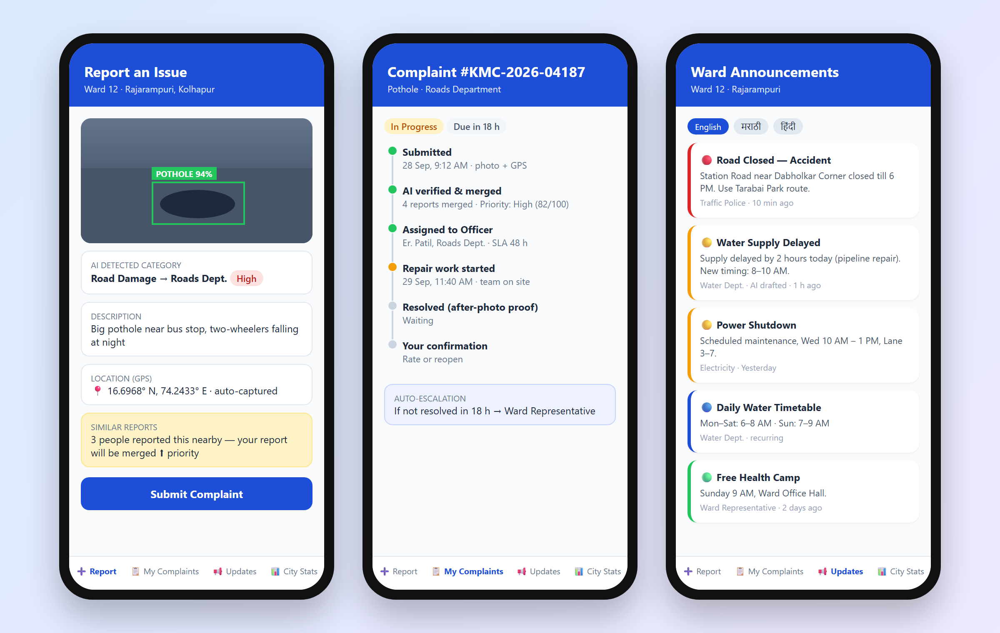
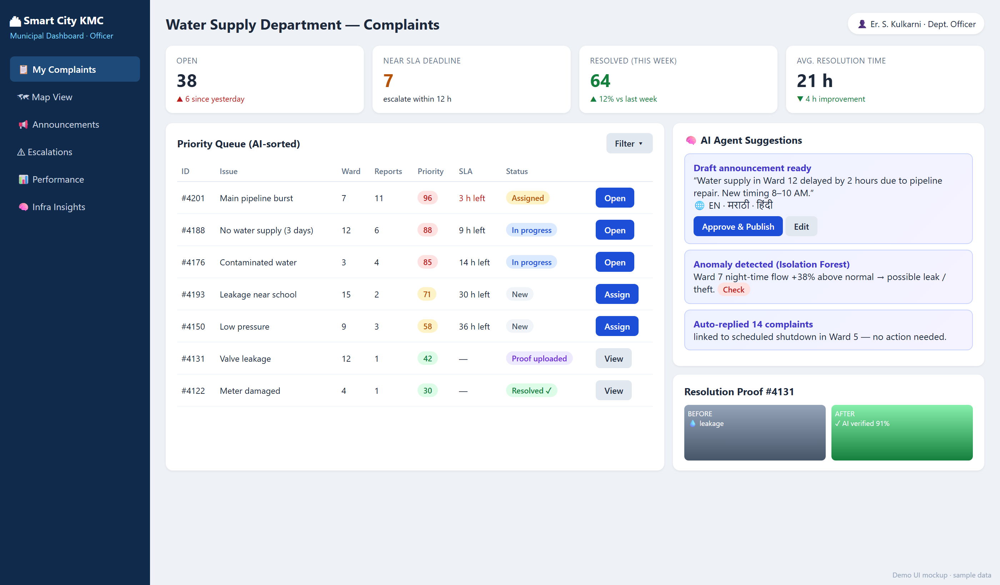
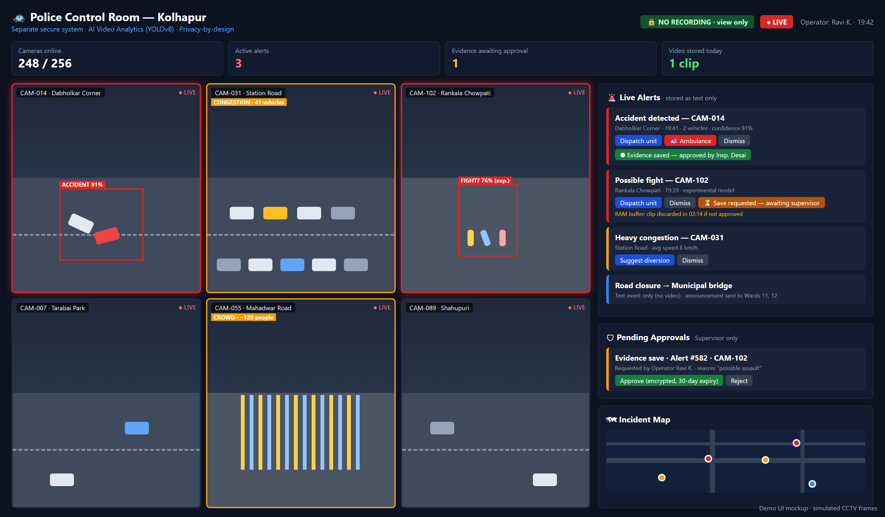

# Design.md — Visual Design System

Applies to the **Citizen App** and the **Municipal Dashboard** (light theme) and the **Police Control Room** (dark theme). Reference mockups: [`docs/assets/`](assets/).

| Citizen App | Officer Dashboard | Police Control Room |
|---|---|---|
|  |  |  |

---

## 1. Principles
1. **Clarity first** — the most urgent thing is the most visible thing (priority colours, SLA timers).
2. **Simple for citizens** — one main action per screen, large touch targets, minimal typing.
3. **Multilingual by default** — layouts must fit Marathi/Hindi text (often 20–30 % longer than English).
4. **Consistent status language** — the same status/priority always has the same colour and label everywhere.
5. **Accessible** — WCAG AA contrast, never rely on colour alone (always add text/icon).

## 2. Colours

### 2.1 Brand & neutrals
| Token | Hex | Use |
|---|---|---|
| `primary` | `#1D4ED8` | Primary buttons, active tab, links, app header |
| `primary-dark` | `#1E3A8A` | Pressed states, headings on light blue |
| `primary-light` | `#DBEAFE` | Selected rows, info backgrounds |
| `navy` | `#0F2A4A` | Dashboard sidebar, cover backgrounds |
| `accent` | `#6D28D9` | AI features (AI badge, AI suggestions, insights) |
| `accent-light` | `#EDE9FE` | AI suggestion card background |
| `bg` | `#EEF2F7` | Dashboard page background |
| `bg-app` | `#F8FAFC` | App screen background |
| `surface` | `#FFFFFF` | Cards, tables, inputs |
| `border` | `#E2E8F0` | Card / input borders, dividers |
| `text` | `#1E293B` | Main text |
| `text-muted` | `#64748B` | Labels, secondary text |
| `text-faint` | `#94A3B8` | Placeholders, timestamps |

### 2.2 Semantic
| Token | Text | Background | Use |
|---|---|---|---|
| `success` | `#15803D` | `#DCFCE7` | Resolved, closed, verified, positive trend |
| `warning` | `#B45309` | `#FEF3C7` | Due soon, medium priority, important announcement |
| `danger` | `#B91C1C` | `#FEE2E2` | Overdue, high priority, emergency, errors |
| `info` | `#1D4ED8` | `#DBEAFE` | In progress, general info |
| `neutral` | `#475569` | `#F1F5F9` | New, merged, inactive |

### 2.3 Status → colour (use everywhere)
| Status | Colour token | Label (en) |
|---|---|---|
| `new` | neutral | New |
| `merged` | neutral | Merged |
| `assigned` | warning | Assigned |
| `in_progress` | info | In progress |
| `resolved` | accent | Resolved – awaiting confirmation |
| `closed` | success | Closed |
| `reopened` | danger | Reopened |
| `rejected` | neutral | Rejected |

### 2.4 Priority → colour
| Level | Colour | Badge |
|---|---|---|
| `low` | success | green pill with score |
| `medium` | warning | amber pill |
| `high` | danger | red pill |
| `critical` | `#7F1D1D` text on `#FECACA` | dark red pill + ⚠ icon |

### 2.5 Announcement priority
| Priority | Left border | Icon |
|---|---|---|
| `emergency` | `#DC2626` | 🔴 / `AlertTriangle` |
| `important` | `#F59E0B` | 🟡 / `Bell` |
| `general` | `#22C55E` | 🟢 / `Info` |

### 2.6 Heatmap scale (pending complaints)
`#22C55E` (0–5) → `#84CC16` (6–10) → `#EAB308` (11–20) → `#F97316` (21–35) → `#DC2626` (35+)

### 2.7 Police dark theme
| Token | Hex |
|---|---|
| `police-bg` | `#0B1220` |
| `police-surface` | `#111A2E` |
| `police-surface-2` | `#1A2338` |
| `police-border` | `#1E293B` |
| `police-text` | `#E2E8F0` |
| `police-muted` | `#94A3B8` |
| `alert-red` | `#DC2626` (accident / fight) |
| `alert-amber` | `#F59E0B` (congestion / crowd) |
| `no-recording` | `#14532D` bg / `#BBF7D0` text |

## 3. Typography
| Use | Font |
|---|---|
| UI (Latin) | **Inter** (Google Fonts) — fallback `Segoe UI`, `Roboto`, system-ui |
| Marathi / Hindi | **Noto Sans Devanagari** |
| Code / IDs | `JetBrains Mono` or system monospace |

Load both Inter and Noto Sans Devanagari; set the font stack as `Inter, "Noto Sans Devanagari", system-ui, sans-serif` so Devanagari falls back correctly.

### Type scale
| Token | Size / line-height | Weight | Use |
|---|---|---|---|
| `display` | 28 / 36 | 700 | KPI numbers |
| `h1` | 22 / 30 | 700 | Page titles |
| `h2` | 18 / 26 | 600 | Section titles, app screen titles |
| `h3` | 15 / 22 | 600 | Card titles |
| `body` | 14 / 22 | 400 | Default text (app: 15 / 22) |
| `small` | 12 / 18 | 400 | Labels, table text |
| `caption` | 11 / 16 | 500 | Timestamps, uppercase labels (letter-spacing 0.4px) |

Minimum text size: 12 px on dashboard, 13 px in the app.

## 4. Spacing, radius, elevation
- **Spacing scale (px):** 4 · 8 · 12 · 16 · 20 · 24 · 32 · 48 (Tailwind `1 2 3 4 5 6 8 12`)
- **Radius:** inputs/buttons 8 · cards 10–12 · pills 999 · app phone cards 12
- **Shadow:** cards `0 1px 3px rgba(0,0,0,.07)`; modals `0 10px 30px rgba(0,0,0,.15)`
- **Dashboard layout:** fixed sidebar 220 px (`navy`), content padding 20–24 px, KPI row of 4 cards, 2-column grid (1.6fr / 1fr)
- **App layout:** 16 px screen padding, bottom tab bar (4 tabs), primary button full width, touch targets ≥ 48 px

## 5. Components

| Component | Spec |
|---|---|
| **Primary button** | `primary` bg, white text, 600 weight, radius 8, height 44 (app 48) |
| **Secondary button** | `#E2E8F0` bg, `text` colour |
| **Danger button** | `danger` text colour on white with red border, or solid `#DC2626` for destructive confirm |
| **Status chip** | pill, 11–12 px, 600 weight, semantic colours from §2.3 |
| **Priority badge** | pill showing score, colours from §2.4 |
| **KPI card** | white card, caption label (uppercase), `display` number, small trend line (▲ green / ▼ red with text) |
| **AI card** | `accent-light` bg, `#C7D2FE` border, title in `#4338CA`, ✨/🧠 icon — always labelled as AI |
| **Timeline** | dots: green (done), amber (current), grey (pending); vertical line `#CBD5E1` |
| **Announcement card** | white card, 4 px left border by priority, title 600, body muted, footer: source · time |
| **Table** | header 11 px muted 600, rows 12 px, row divider `#F1F5F9`, hover `primary-light` |
| **Input** | white, `border`, radius 8–10, label above in caption style |
| **Empty state** | icon + one line + action button ("No complaints yet — Report an issue") |
| **Error state** | `danger-bg` banner with retry button |
| **Toast** | bottom (app) / top-right (dashboard), auto-hide 4 s |

## 6. Icons
- Web: **lucide-react** · App: **lucide-react-native** (or `@expo/vector-icons` Feather set)
- Size 16 (inline), 20 (buttons/nav), 24 (tab bar)
- Common: `Camera`, `MapPin`, `ClipboardList`, `Megaphone`, `BarChart3`, `AlertTriangle`, `ShieldCheck`, `Clock`, `CheckCircle2`, `RotateCcw`, `Sparkles` (AI)

## 7. Citizen App screens
| Tab | Screens |
|---|---|
| ➕ Report | Report form → AI preview → Success |
| 📋 My Complaints | List → Detail (timeline, proof, rate/reopen) |
| 📢 Updates | Announcement feed → Announcement detail |
| 📊 City Stats | Public statistics |
| (header) | Profile / Settings: language, ward, notifications, logout |

Header: `primary` background, white title + ward subtitle.

## 8. Dashboard navigation
| Role | Sidebar items |
|---|---|
| Officer | My Complaints · Map View · Announcements · Escalations · Performance · Infra Insights |
| Ward Rep | Ward Overview · Escalations · All Complaints · Post Announcement · Infra Insights |
| Mayor | City Overview · Ward Heatmap · Departments · Final Escalations · Infra Insights · City Announcement |
| Admin | Users · Wards · SLA Settings |

## 9. Language & tone
- Plain, polite, short. Citizens: "Your complaint is in progress", not "Status updated to IN_PROGRESS".
- Translation keys in `i18n/en.json`, `mr.json`, `hi.json`; English is the fallback.
- Dates: `28 Sep, 9:12 AM` (app), `28-09-2026 09:12` (tables). Time zone Asia/Kolkata.
- Numbers: Indian grouping in UI (`48,905`, `1,27,000`).

## 10. Accessibility checklist
- [ ] Contrast ≥ 4.5:1 for text
- [ ] Every colour-coded item also has a text label
- [ ] Touch targets ≥ 48 px (app)
- [ ] Images have `alt` / `accessibilityLabel`
- [ ] Forms show errors in text next to the field
- [ ] Supports system font scaling in the app
